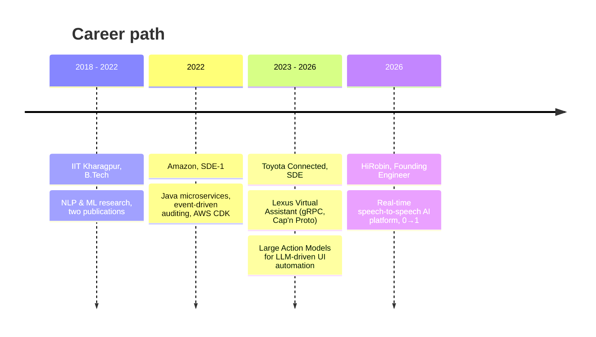

<!-- ============================================================
     Profile README · Geetha Venkata Sai Pardheev Chunduru
     Place this file in a public repo named exactly: GeethaPardheev
     ============================================================ -->

<div align="center">



<p>
<a href="https://linkedin.com/in/geetha-pardheev"></a>
<a href="mailto:geethapardheev2@gmail.com"></a>


</p>

</div>

---

```python
class Pardheev:
    role       = "Backend Software Engineer · Distributed Systems · Production AI/LLM"
    education  = "B.Tech, IIT Kharagpur (2018–2022) · GPA 8.43"
    experience = "4+ years  →  Amazon  ·  Toyota Connected  ·  Founding Engineer at a 0→1 startup"
    builds     = ["distributed backends", "LLM & agent systems", "AI evaluation", "real-time voice AI"]
    speaks     = ["Python", "Java", "Rust", "Go", "C++", "Kotlin"]
    research   = ["ACM WWW Companion '23", "Expert Systems with Applications '22"]

    def philosophy(self):
        return "Own it from the whiteboard to the pager: architecture → production → p95."
```

## ⚡ Impact at a glance

<div align="center">

| 📞 **36M+** | 🔁 **500K+ / day** | ⏱️ **< 2s p95** | 💸 **~42%** | 🚗 **4M+ DAU** | 📊 **10M+ / day** |
|:---:|:---:|:---:|:---:|:---:|:---:|
| production voice calls served | AI calls on multi-region AWS | conversational voice latency | LLM inference cost cut | Lexus voice assistant users | audit events tracked at Amazon |

</div>

## 🧭 The journey



## 🏗️ What I've built in production

<details open>
<summary><b>🎙️ HiRobin · Founding Software Engineer</b> &nbsp;·&nbsp; <i>Mar 2026 – Sep 2026</i></summary>
<br>

Joined as a founding engineer and built the core of a real-time AI voice platform from zero to production scale.

| 🎙️ Real-time voice | 🤖 Agent orchestration | 🧪 LLM evaluation | 📐 Platform & cost |
|:---|:---|:---|:---|
| Speech-to-speech streaming, session migration, WebSocket recovery | Tool-calling, scheduling, retries, callback recovery | Synthetic callers, regression suites, quality scoring | A/B experimentation, tracing, ~42% inference cost cut |

- **Voice platform** serving **500K+ calls/day** to **100K+ DAU** at **< 2s p95**, **36M+** calls on multi-region AWS
- **Voice infra** across Gemini Live and ASR + LLM + TTS pipelines: prewarming, session migration, resilient WebSocket recovery
- **Agent orchestration engine** with tool-calling, scheduling, batching and callback recovery: **700K+** outbound calls, **300K+** autonomous workflows
- **LLM evaluation stack** from scratch: grounded regression suites, synthetic AI callers, quality scoring across **32M+** conversations
- **~42% inference cost reduction** via prompt redesign, input-audio gating and canned responses, holding **0.87/1.0** quality
- **In-house A/B experimentation** with deterministic sticky assignment and zero-storage variant allocation
- **Observability** with distributed tracing, call-level correlation and PII-masked logs

</details>

<details>
<summary><b>🚗 Toyota Connected · Software Development Engineer</b> &nbsp;·&nbsp; <i>Mar 2023 – Mar 2026</i></summary>
<br>

- **Lexus Next-Gen Virtual Assistant:** high-throughput backend components in **gRPC + Cap'n Proto** for **4M+ DAU / 15M+ requests per day**, with **< 2s** responses and **sub-100ms** internal latencies
- **Large Action Models:** owned HLD & LLD for a device-agnostic backend for GenAI-driven UI automation, delivering a 0→1 Android system at **< 6s per action** using **Amazon Bedrock** and on-device LLM reasoning
- **Automation architecture:** containerized execution framework, extended to Toyota One App (Android & iOS) and the Lexus Virtual Assistant
- **Severe Weather Alerts:** geo-targeted real-time alerting on **SQS + Redis**, cutting delivery latency **3s → < 1s**
- **Smart Climate:** adaptive HVAC logic and zone-based microphone processing for context-aware in-vehicle voice

</details>

<details>
<summary><b>📦 Amazon · Software Development Engineer I</b> &nbsp;·&nbsp; <i>Jun 2022 – Mar 2023</i></summary>
<br>

- **Java microservices (Google Guice)** powering regional product-control workflows
- **Auditing subsystem** on Lambda + DynamoDB Streams + SQS, tracking **10M+ events/day** in near real time
- **Fault-tolerant retry mechanism** extending failed-event retention from **24 hours to 14 days**
- **Infrastructure as Code** with AWS CDK, plus CloudWatch monitoring, alerting and anomaly detection

</details>

## 🔬 Research & publications

<table>
<tr>
<td width="50%" valign="top">

### 📄 Syntax-Aware Style Detection
**ACM WWW Companion '23**

Hybrid **BERT + Graph Convolutional Network** that reads syntax graphs to detect *formality* and *politeness*.

🎯 F1 **0.85** (formality) · **0.83** (politeness), beating all baselines

[](https://dl.acm.org/doi/abs/10.1145/3543873.3587352)
[](https://github.com/GeethaPardheev/formality)

</td>
<td width="50%" valign="top">

### 📄 CCNet: Classifying Accident Reports
**Expert Systems with Applications, 2022**

End-to-end NLP pipeline over **16,323** unstructured construction accident reports with a novel hybrid network, **CCNet**.

🎯 Weighted F1 **0.723 → 0.780** over baseline

[](PASTE_YOUR_PAPER_LINK_HERE)

</td>
</tr>
</table>

## 🛠️ Projects on this profile

| Project | What it is | Stack |
|---|---|---|
| 🩺 **[MedicalVoiceAI](https://github.com/GeethaPardheev/MedicalVoiceAI)** | Real-time medical scheduling voice agent: a LiveKit agent worker bridging Deepgram STT, Cartesia TTS and OpenAI/Anthropic LLMs with tool execution, plus a React dashboard streaming live transcripts, tool calls and summaries |     |
| 🧠 **[formality](https://github.com/GeethaPardheev/formality)** | Ensemble transformer classifiers (BERT, RoBERTa, ELECTRA, XLNet, DeBERTa) for formality detection; best ensemble hits **94.91%** on GYAFC. Groundwork for the ACM WWW '23 paper |   |
| 🦀 **[place_capitals](https://github.com/GeethaPardheev/place_capitals)** | Rust crate for place-type detection and capital lookup across countries and US states |  |
| ⚡ **[pocket-pikachu](https://github.com/GeethaPardheev/pocket-pikachu)** | A native macOS desk companion with focus/Pomodoro modes, break reminders and physics-driven animations. My for-fun build |   |

## 🧰 Toolbox

**Languages**
<br>


**Backend & APIs**
<br>


**Data**
<br>


**Cloud & DevOps**
<br>


**AI Infrastructure**
<br>


**Architecture:** distributed systems · microservices · event-driven design · async messaging · concurrency control · fault tolerance · high-throughput processing

## 🎓 Education & achievements

<table>
<tr>
<td valign="top" width="55%">

**Indian Institute of Technology Kharagpur**
<br>B.Tech · 2018 – 2022 · GPA **8.43 / 10**
<br><sub>NLP & ML researcher, Aug 2021 – Apr 2022</sub>

</td>
<td valign="top">

🏅 **JEE Advanced 2018:** AIR **1618** (top 1%)
<br>🏅 **JEE Main 2018:** AIR **958** (top 0.1% of 1.5M+)

</td>
</tr>
</table>

---

<div align="center">

### 🤝 Let's build something that scales

Hiring for **backend, distributed systems or AI infrastructure** roles? I'd love to talk.

<a href="mailto:geethapardheev2@gmail.com"></a>
<a href="https://linkedin.com/in/geetha-pardheev"></a>

</div>
